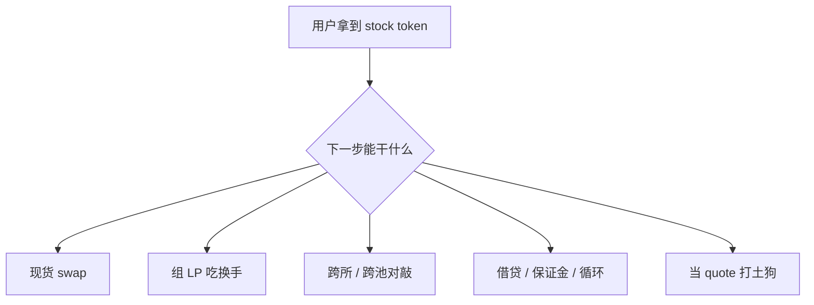
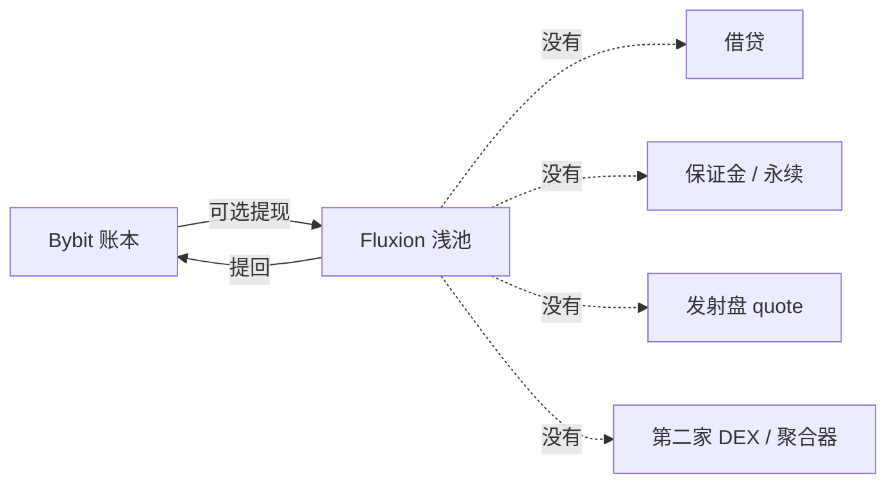

## 1. Stocks Assets 在链上的表现形式

### 1.1 资产上链后的方式

我们认为 tokenized assets 之所以是有意义的，便在于 crypto 在接口层将它变成了可进 router、可进 vault、可进 bonding curve 的 fungible token。后面所有融合形态，都建立在这一层之上。当然整个 tokenized assets 的 lifecycle 是非常长的一个链路，从底层资产的 canonical token 到最后的分发，但是对于链底层项目方而言，我们只需要在意的是二级市场这一阶段。

在二级市场中，首先是如果获取已经完成 tokenized 的 assets，主要的途径包括：

1. 通过 bridge 从其他生态中桥接而来
2. 通过做市商获取，获取途径包括 CEX，AMM DEX，RFQ 以及 Prop AMM
3. 通过其他 DeFi 协议获取，比如 lending，vault 等

### 1.2 资产上链后的存在形式

而一旦用户获得了 tokenized assets 之后，这些资产在链上能做什么？这才是用户最关心的一点，对于用户来说，最大化地放大他们的资本效率，这才是他们愿意将自己的 tokenized assets 放到链上来的原因。因此，我们需要分析一下 token assets 与原本的 crypto native 产品之间能够做什么样的结合，如何去做到资本效率的最大化。

| 形态 | 用户在干什么 | 协议怎么接 | 与普通 crypto 的关键差异 | 简单例子 |
| :-- | :-- | :-- | :-- | :-- |
| **比较主流的玩法** |
| **现货** **公开 AMM / DEX** | 用稳定币买卖 stock token，或组 LP | 标准 pair / CL 池 + router；对协议等价于任意 ERC-20/SPL | 主市场有开闭市，链上池周末仍机械成交；显示价 ≠ 可执行深度；LP 更易 adverse selection | <ul><li>BSC：Pancake 等有 tokenized stocks 品类入口；</li><li>Mantle：Fluxion 有 `USDC/wXStock` 池但活跃偏低；</li><li>RH Chain：已观察 aggregator / Algebra 类路径</li></ul> |
| **冷启动** **LP / 交易激励** | 为奖励组 LP、刷量、冲榜 | Gauge / campaign / 零费率 / 周末乘数 / 积分（与 meme 冷启动同工具箱） | 可迅速做成焦点交易对，但量常集中少数 ticker；周转可远高于显示流动性 → **量 ≠ 深度** | <ul><li>Trust/Ondo 类活动期放量；</li><li>bStocks 池量可高度集中于 QQQ/SPCX 等；</li></ul> |
| **借贷** **作抵押** | 存 stock 借稳定币，保留方向性敞口；**通常不是借券做空** | Money market：LTV / 清算阈值 / supply·borrow cap / oracle；常见 **可抵押、borrow cap=0** | 清算依赖时段感知价格；不查 `publishTime`/`marketStatus` 会把周五价当新价；赎回暂停改变退出能力 | <ul><li>BSC：Venus 等 bStocks 市场（可抵押、不可借出股票）；</li><li>Solana：xStocks × Kamino 从 Swap 到 collateral；</li><li>另有面向 tokenized equities 的专用 lending 叙事</li></ul> |
| **衍生品** **Perps / Options** | 保证金交易股价敞口；可不持有 stock token | Perp 引擎 + equity oracle + funding/OI/ADL；（可选）现货对冲。须区分 **合成/oracle perps**（弱依赖现货）vs **强锚定/可交割**（强依赖现货） | 开盘跳空；按 crypto 连续市做 funding/清算会在周末误伤 | 发行人叙事：stocks→collateral→lending/perps；社区称金融化层可快于托管 AUM；BSC 侧完整 live equity perp 证据仍参差；perp 热 ≠ 现货深度自动补齐 |
| **与 stocks assets 可结合的其他 DeFi 产品** |
| **收益拆分** **Pendle 类 PT/YT** | 把本金 vs 收益/积分拆开交易：买 PT 锁固定贴现，买 YT 赌收益、分红与 points | 需可计息或可积分的 SY/包装资产 → 拆成 PT/YT → Pendle AMM；到期赎回；常叠 points 与二次借贷 loop | 股票侧收益常来自**分红现金流 + 积分/空投预期**，不只是 staking APY；除息/快照日会扰动 implied yield；公司行动与分红日历进入定价 | **已出现实锤组合：** CT 广泛交易 xStocks 相关 Pendle 市场（如 `STRCx` YT），用 YT 刷 xStocks points，并讨论分红快照对 IY 的影响；第三方口径中 Pendle Yield 已占 tokenized-stock DeFi TVL 可观份额（须独立复算） |
| **结构化** **Vault / 指数** | 持有一篮子、自动再平衡或结构化票息 | Index / vault / strategy + keeper + 费用 | 拆股/分红/并购/退市更密；NAV 偏差与再平衡滑点直接吃掉「跟踪美股」卖点 | 相对现货/激励，**可验证大规模产品仍偏早期**；叙事多于可复核 TVL——标为潜力层，前置是深度 + 状态机 + 公司行动管道 |
| **事件** **Prediction / Event market** | 对财报、指引、并购、价格区间、宏观事件做条件下注；或把「股权结果」做成可交易份额 | 结果份额（Yes/No 或区间）+ 结算 oracle / 争议机制；**三条接法：** ① 纯事件合约（弱依赖 stock token）② stock token 作保证金/抵押 ③ 用 stock 现货或官方价作结算源 | 与 perps 不同：到期二元/分段支付，核心是**规则措辞与结算源**，不是连续 funding；美股日历（财报窗、停牌）直接变成市场设计参数；合规与「是否构成证券/博彩」因地而异 | 既有调研将 event/prediction 列为 stock-like 权利形态之一；链上预测盘（Polymarket 等）与受监管事件盘（Kalshi 等）成熟的是**事件层**，与 tokenized equity **现货闭环**仍多为相邻而非默认绑定；亦见「预测平台股权被再次 tokenize」的反向叙事，不等于 stock token 已大规模进预测盘 |
| **Meme / Launchpad** | 用 stock 作 **计价/底池** 发射 meme，或炒股票叙事币 | Bonding curve → 迁 AMM → router | 分母「更硬」的 thesis 与浅池错价并存；闭市 + 错误路由可打飞局部价；品牌风险回流发行方与公链 | [four.meme](http://four.meme) 等扩展 bStocks 底池（如 `SPCXb`），话术 MemeFi×TradeFi；CT 有 SPYB 作 meme 分母 thesis；SPYB 类波动说明局部状态价 ≠ 全市场成交价 |

## 2. Stocks 在别的生态中的流通现状

### 2.1 bStocks 在 BSC 生态中的 adoption 情况

我们认为在 BSC 上 bStocks 的状态就是由顶级 CEX 的分发（Binance/钱包）引导的公开 AMM 的高换手 + Stock Meme 生态组成。详细点说，在 BSC 中对于 bStocks 的冷启动是比较成功的，他们最初的设计是通过补贴激励用户将 bStocks 从 Binance CEX 带到链上，主要的方向有：

1. 鼓励用户去链上做交易
   1. Aster 的 spot 交易大赛（\$100k）
   2. Trust Wallet 的 SPCXB 的交易大赛（\$100k）
   3. Binance alpha 积分
2. 鼓励用户将 bStocks 与 DeFi 结合
   1. PancakeSwap 鼓励用户参与 SPCXB 和 SKHYB 这两个资产的池子的 LP
   2. Lista/Venus 借贷激励（100k），鼓励用户将自己的 bStocks 作为 collateral 而借出稳定币（[https://lista.org/lending/borrow?zone=bstocks](https://lista.org/lending/borrow?zone=bstocks)）

---

但是这种传统玩法的效果并没有想象中的好，Lista 的 bStocks 池子目前总的 TVL 大约是 5M 左右，还处于个非常早期的阶段。而真正引爆 bStocks 的依然还是 meme。像 [four.meme](http://four.meme) 这样的 Launchpad 在 20260731 开始支持使用 bStocks 作为 quote token 来发射 meme，然后就走出了一系列 meme，甚至在一定程度上影响了非交易时段的 stocks 价格。

> BSC 的 meme Launchpad 中存在大量用 bStocks 为 quote assets 的交易池

<Frame>
  
</Frame>

> 由于 meme 价格的波动导致的 SPYB 在非交易时段发生超过 100% 的波动


我们从 dexscreener 中去查看了一些 bStocks 的池子情况：

| 池类型 | 例子 | h24 volume（约） | h24 liquidity（约） | 解读 |
| :-- | :-- | :-- | :-- | :-- |
| 股票 / 稳定币 | SPCXB / USDT（Pancake） | **\$11.3M** | **\$4.2M** | 经典现货换手；量可高于显示流动性 → 高周转 |
| 股票 / BNB | SPCXB / WBNB | **\$13.0M** | \$1.1M | 同上 |
| 股票 / 稳定币 | SPYB / USDT | **\$7.7M** | \$0.67M | 指数类 bStock 主力美元池 |
| **股票 / meme** | SPYB / 币有 | **\$3.3M** | \$0.44M | stock 作计价/对手资产 |
| meme / stock | SUMMER / SPYB、币安城 / SPYB 等 | \$0.4M–\$1.6M 级 | 更浅 | 风险与 SPYB 浅池联动 |

我们可以看到在 BSC 上存在一个“高 volume / 低 liq 比值”的现象，这是一个非常典型的套利、刷量的行为体现，但是高 volume 带来的高换手率也足以解释为什么 BSC 上有用户愿意去组 LP（将区间设置的很窄，增加交易几率，然后再反过来买回资产，形成交易\<>组 LP 循环）

而 bStocks 在 BSC 上的整体的飞轮效应可以总结为下面这张图：


<Info>
  20260813 的更新，bStocks 推出了支持其他币股 1:1 兑换成 bStocks 的活动，这会进一步增加其链上铸造量和 volume（套利引发的）
</Info>

### 2.2 Robinhood 中 stocks 的 adoption 情况

RobinHood 是最近最火热的一条链，但目前看下来，它似乎依然存留在 meme 叙事当中。它本身是 Web 2.0 的券商，拥有非常好的 stocks 用户基础，因此我们需要去查看一下它的 web2 背景是否对 tokenized assets 这个叙事有帮助。

目前其链上数据非常好看：TVL \$508M、稳定币 \$620M、DEX 24h \$523M；同时其二级流动性来源也非常丰富：

- RFQ（0x / 1inch Fusion / LiFi）
- AMM（Uniswap）
- propAMM（Rialto）
- Lighter 订单簿（现货 + 永续）

和 BSC 上的 bStocks 行情类似，RobinHood chain 上依然也是通过 meme 来赋能 stocks assets 的，Pons / Flap / Bankr / [long.xyz](http://long.xyz) / Sushi Launch 上发土狗，然后通过 stocks 作为 quote token。

那么 RobinHood chain 上的传统 DeFi 与 stocks 结合的如何呢？

| 能力 | 官方状态 | 用量 |
| :-- | :-- | :-- |
| Morpho 借贷 | 47 个股票市场；Earn 走 Morpho | 股票抵押合计约 **\$2.3k**；同一 venue 其他资产约 **\$360M** |
| Robinhood Earn | USDG 存 Morpho，宣传约 7% APY | 这才是 Morpho / Steakhouse 数亿美元 TVL 的来源；**与股票无关** |
| Lighter 保证金 | Stock Tokens 可作 perps collateral | 协议在 RH 上 TVL 约 \$12M；未拆股票占比 |
| Arcus | 官方 perps 伙伴 | TVL 约 \$21M |
| Uniswap 现货 | 官方 AMM | 链上 Uniswap TVL 约 \$83M，不全是股票池 |

### 2.3 Solana 中 stocks 的 adoption 情况

那么 Solana 上的 stocks assets 的情况怎么样呢？我们知道 Solana 被 kraken 和 bybit 这样的 CEX 支持着，并且像 xStocks，ondo 这样的币股协议也都早早的支持了 Solana，我们看 Solana 的数据情况：xStocks 的 TVL 大约是 \$377.1M（xStocks 的 TVL 几乎全在 Solana 上），Ondo 的 TVL 大约是 \$28.9M（ETH \$606M / BSC \$320M）

我们抽样一下 xStocks 的不同池子的情况：

| 对 | h24 vol | liq |
| :-- | :-- | :-- |
| SPYx/USDC（Raydium 浅池） | **\$2.28M** | \$0.31M |
| SPYx/USDC（Raydium 深池） | \$0.15M | **\$2.86M** |
| CRCLx/USDC（两大池） | **\$3.8M** | ~\$2.4M 各 |
| NVDAx/USDC | \$0.82M | \$2.50M |
| TSLAx/USDC | \$0.42M | \$1.89M |
| STONK/SPYx | **\$0.87M** | \$0.46M |
| TREE/AAPLx | \$0.29M | \$78k |

BSC / Robinhood 的高换手，主因是发射盘把股票当成必须经过的 quote。Solana 主发射盘 [Pump.fun](http://Pump.fun) 的曲线计价物是 SOL，不是 SPYx。并且我们分析 DEX 的 trading 情况的时候发现更像做市/套利，不像组合买入：旗舰 USDC 池单笔均额 **\$200–580**，日成交 **3–6 千笔**（SPYx/USDC 浅池 6362 笔均 \$265；CRCLx 两大池 3273+4695 笔）。

> 关于如何实现套利，方式有非常多：
>
> 1. 跨交易场所套利：Kraken 10 只 24/7（TSLAx/SPYx/NVDAx/CRCLx…）、其余 24/5，因此在周一需要通过套利将价差压回 1%
> 2. 跨发行人套利：`SPCX`（Sunrise）vs `SPCXx`（xStocks）是最干净的样本：日 \$61 万、均 \$150、买卖笔数不对称
> 3. 休市期间的期货套利：一级周末关闭；链上二级 24/7。有人在用 DEX 做美股没开时的价格，做市商用 ATS/期货/内部模型报价，再在开盘与现货对齐

而除了 trading 之外，Solana 上的 xStocks 与其他传统 DeFi 的结合也更加夯实：

Kamino xStocks Market

| Reserve | max LTV | Supply USD | Borrow USD |
| :-- | :-- | :-- | :-- |
| **USDC** | 80% | **\$6.00M** | **\$5.39M** |
| **SPYx** | **73%** | **\$4.43M** | \$201k |
| QQQx | 70% | \$3.04M | \$56k |
| NVDAx | 55% | \$3.03M | \$13.5k |
| GOOGLx | 60% | \$2.97M | \$0 |
| TSLAx | 55% | \$2.75M | \$1.5k |
| MSTRx / CRCLx / AAPLx / HOODx | 30–40% | 合计 ~\$2.5M | ≈0 |

Jupiter Lending：

| Vault | CF / LT | Collateral | Debt |
| :-- | :-- | :-- | :-- |
| SPYx / USDC | 75 / 85 | **\$7.87M** | **\$3.12M** |
| SPYx / JupUSD | 75 / 85 | \$3.27M | \$1.52M |
| QQQx / USDC | 75 / 85 | \$2.01M | \$0.59M |
| NVDAx / USDC | 65 / 75 | \$1.73M | \$0.54M |
| TSLAx 等其余 4 个 | 65–75 | 合计 ~\$2.5M | ~\$1.0M |
| **合计** |  | **\$17.38M** | **\$6.75M** |

### 2.4 其他需要关注的生态与 stocks 的结合

#### 2.4.1 x Layer 宣传的 80% xStocks trading volume

> okx 宣传他们一周的 xStocks trading volume 大约是 \$447M


近期有看到 X Layer 宣传自己的链在支持 xStocks 之后已经占据了 weekly trading volume 的 80%，但是这似乎和 Solana 的宣传是类似的（都宣称自己是 xStocks 的主战场），因此我们在 Dune 上获取了一下每条链上的 xStocks 的交易情况：

> Weekly Trading Volume


> Weekly Trading Count


我们可以看到从 Dune 的数据来看 Solana 确实还是占据交易量和交易数量的大头，但是 okx 不太可能会在这方面进行虚假宣传，因此可能是 Dune 的数据收集有误（待确认）

最后我们去查看了 okx wallet 的 Boost 活动页面，发现了他们近期正在进行 RWA 的交易大赛，我们查看了上一周的情况，参与人数大约是 1.1k，最低的交易量是 50k，前十名基本都是 10m 以上，第一百名大约是 1.3m，因此我们推测一周的交易量大约是 0.4-0.6B，大致符合 447M 的宣传数据。同时我们分析其交易数据后发现，xStocks 的交易每天的数据和行为都非常类似，中位数都分布在 \$100 左右，因此我们推测 xStocks 在 X Layer 交易行为基本是通过 Boost 活动激励发生的，并非用户的实际需求。

> okx wallet 上的 xStocks 交易大赛一周的 trading volume 大约是 0.4-0.6B


#### 2.4.2 Hyperliquid \<> xStocks 的合作

剩下一个需要关注的就是 Hyperliquid，他们在本周将 xStocks 引入到了 Hypercore CLOB，目前的二级市场获取方式还是需要通过 Solana 然后走 CCIP 去到 HyperEVM 并最终 wrap 到 Hypercore 的方式。

那么 xStocks 在 Hyperliquid 中的表现怎么样呢：

| HyperCore | Ticker | 状态 | 24h vol | 24h tx | 对应永续 24h vol |
| :-- | :-- | :-- | :-- | :-- | :-- |
| NVDAX/USDC | NVDAx | 已开 | **\$27k** | 125 | xyz:NVDA \$41M |
| SPYX/USDC | SPYx | 已开 | **\$44k** | 63 | 无同名永续（指数是 xyz:SP500 \$307M） |
| QQQX/USDC | QQQx | 已开 | **\$68k** | 57 | 无同名永续（指数是 xyz:XYZ100 \$348M） |
| SKHYX/USDC | SKHYx | 已开 | **\$40k** | 212 | xyz:SKHY \$163M |
| MUX/USDC | MUx | 已开 | **\$51k** | 536 | xyz:MU \$196M |
| **已开合计** |  |  | **~\$230k** |  |  |
| SNDKX / SPCXX / TSLAX / AAPLX / CRCLX |  | 已拍未开 | 0 | — | 对应永续已有量 |

因此我们可以看到，perps 依然是 Hyperliquid 的基本盘，但是这里可以做一个大胆的预测，由于一些 Neutral Delta 的策略存在（比如双向持有 perps+spot，赚取 funding rate），Hyperliquid 上的 stocks spot 依然会有一定的市场。

## 3. Stocks 资产如何在链上形成飞轮

在这个章节中，我们需要结合之前对其他生态 tokenized stocks adoption 的情况，以及我们在第 1 章中研究的 tokenized stocks，探讨它们在链上会与哪些协议结合。去分析出一个抽象的 tokenize stocks，应该在链上如何形成一个生态的飞轮。首先我们需要明确的一点是，Stock 资产的 mass adoption 并不需要关注你部署了多少合约、接了多少协议，最终，我们还需要把所有的指标都落到用户以及交易上，因此，如果我们想要量化整个飞轮效应在链上的指标情况的话，可以体现在以下几个方面：

1. **更多用户**愿意来成交，在这里我们并不只追求真实用户，机器人，agents 都是我们的潜在客户
2. **固定规模可执行深度**改善或至少不塌（`$10k/$50k` 滑点，而不是 TVL 截图）
3. **持仓 / 抵押 / 收益层需求**上升（TVL、借贷未偿、YT/PT 未到期名义等），说明钱愿意停在资产上。
4. **新应用吃同一套资产与流动性**（借贷、perp、vault 复用 canonical token 与报价），而不是每个产品各铺一套孤岛流动性

### 3.1 目前整个生态中用户行为是什么样的？

首先我们要确定的一点就是，目前整个区块链生态中还存留的用户，他们都在做什么？他们喜欢进行什么样的交易活动？他们更倾向于去参加哪些协议？我们查看了 Defillama 的数据，排除掉稳定币的费用，其他协议的使用程度规模小很多，但路径很集中。同一天的费用排行里，去掉稳定币发行商之后，前排几乎全是这几类：Pump / Axiom / GMGN（meme 发射与终端）、Uniswap / Pancake / Meteora（现货 DEX）、Hyperliquid（永续）、Aave / Morpho（借贷）、Polymarket（预测市场）。24 小时成交上，链上永续约 **\$15.6B**，现货 DEX 约 **\$4.7B**，永续大约是现货的三倍。

留下来的人，还在为这几件事付手续费。能对上号的大致就两类：交易，钱在转；DeFi，钱停下来之后还要继续提效。

#### 3.1.1 做交易

首先是做交易，我们认为可以分为以下几类

#### 3.1.1.1 做币股交易

留下来的股票交易，大致三种意图叠在一起。

1. **真的在配美股敞口**
   1. 入口在 Kraken / Bybit / Binance / OKX，提到 Phantom 或币安钱包，再走 Jupiter / Pancake。周末一级申赎关掉，二级 AMM 还开着，所以总有人把链上盘口当成美股没开时的价格发现。 这其实就是我们认为的币股市场的一片蓝海区域，即非 RTH 时间段币股的定价能力。（[https://x.com/agintender/article/2088240935276876180](https://x.com/agintender/article/2088240935276876180)）
2. **在吃价差**
   1. 同一只 NVDA / SPY，CEX 账本、Raydium 深浅池、Pancake、X Layer、HyperCore、Robinhood 链可以同时报不同的价。第 2 章已经写过：Solana 上 CRCLx 两个 USDC 大池并行，SPCXx 和 Sunrise 的 `SPCX` 对敲，都是这种形貌。股票在链上 24/7，底层交易所 24/5，中间那几个小时就是专业资金的主场。
3. **股票被拿去当 meme 的 quote token**
   1. BSC 上 [four.meme](http://four.meme) 把 SPYB / NVDAB 焊进发射漏斗，Robinhood 链上 Pons / Flap 也在走同一条路。这时成交记在股票 ticker 上，用户脑子里买的是土狗。

#### 3.1.1.2 做永续合约交易

永续留下的是两类人。一类是做趋势，BTC / ETH / HYPE / 个股，杠杆开着过夜。一类是把永续当对冲工具，现货或 Pendle / 稳定币收益放一边，空单放另一边。如果只做现货池，又没有可对冲的永续、也没有能被永续当腿用的库存，**专业资金没有理由把股票库存停在这条链上。**

另外我们需要注意的是，其实币股的交易主战场也在永续上，详细数据可以看 2.4.2 章节

#### 3.1.1.3 Delta Neutral Arbitrage 交易

这是我认为链上 trading volume 占比非常大的一块，随着 crypto 市场的专业化程度越来越高，有越来越多的量化团队以及个人不再倾向于去做趋势交易，而是转向做中性套利，追求稳定的收益。目前主流的方式有：

1. **资金费率对敲**
   1. 一边在 Binance / Hyperliquid 持有现货或多头，一边在另一家永续上对锁。Pendle 的 Boros 已经把这种费率差收成可交易的固定收益。
2. **合成美元**
   1. Ethena 仍有约 **\$43 亿** TVL。它把现货多头和永续空头焊成 USDe，再被拿去 Aave / Pendle 上循环。用户感知是「稳定币有收益」，底层是中性敞口在收 funding。
3. **跨所、跨池、跨发行人**
   1. 股票上是 xStocks / bStocks / Ondo / Robinhood 的价差；预测市场上是 Polymarket 和 Kalshi 同一事件不同价。浅池、闭市、激励周，都会把缝撑大。
4. **做市本身**
   1. 公开 AMM 的 LP、RFQ / Prop AMM 的报价、Polymarket 订单簿两边挂单，都是在卖流动性，不是在赌方向。Aqua 和币股窄区间 LP，本质上也落在这里。

这类资金对产品的要求很具体：延迟、拒单率、库存能否对冲、周末有没有可执行的价格

#### 3.1.1.4 meme 交易

目前 pump 是 Tether、Circle 之后消耗手续费最高的协议，这也佐证了一件事，新的交易用户并不关心 BTC，而是通过推特等 web2 途径进入，BSC 和 Robinhood 目前也积极将 stocks 资产和 meme 相关联，这样来营造一种币股交易活跃的假象。

当然，Meme 的留存很差，单币轮转很快。meme 品类有人持续来玩，但是单个 ticker 留不住钱。生态能从这里拿到获客和换手，很难拿到过夜的库存，但是我们认为 meme 最大的价值就是它可以不断的去创造空泛的市值。

### 3.1.2 做收益

交易是流量，DeFi 是库存。还留在场上的 DeFi 用户，几乎都在做同一件事：让同一笔钱同时出现在多个仓位里。

#### 3.1.2.1 预测市场

预测市场是 2025–2026 长得最快的原语之一，同样也是用户涌入最多的协议方向，当然，我们看到在世界杯期间，OKX 的预测市场活动做得非常的棒，为他们带来了很多真实用户，而当世界杯结束之后，预测市场的热度有了一定的下滑，而目前存留的用户玩法包括：

1. **Bot 交易**
   1. 依然是量化交易的延伸，包含 endgame，抢占开盘等策略，GitHub 上公开的 Polymarket 工具库浏览量也很高，从回测、挂单管理到 Polymarket–Kalshi 对敲，一整套。
2. **组 LP**
   1. Polymarket 的流动性奖励发给在订单簿两边持续报价的人。认真做的人已经很少在赌某个政客会不会赢，更多是在卖点差。浅市场里 bot 吃零售，深市场里 bot 和 bot 对敲。

当然，目前对于币股来说，预测市场相关性并不强，我们知道预测市场会带有一点对冲的属性，但是预测市场和永续合约不同的是，它是需要有到期结算时间的，因此，你需要做的会是一个类似于目前 Polymarket 中最流行的 crypto 市场一样的预测，每天自动地去创建对应的针对币股价格的预测市场。

#### 3.1.2.2 DEX

DEX 本身没有消失。Uniswap 一天仍有大约 **\$194 万** 费用，Pancake 大约 **\$60 万**，Meteora 大约 **\$57 万**。变的是 LP 不想再把钱锁进一个池子里睡大觉。因此目前出现了一系列优化后的 dex lp 方案；首先是 1inch 的 Aqua，钱不用存进池子，授权之后同一笔余额可以同时背多个策略；成交时协议原子地从钱包拉走 token，再把所得和费用打回来。DefiLlama Aqua 24 小时成交约 **\$1270 万**，累计约 **\$1.5 亿**；Uniswap 一天大约 **\$12 亿**。所以对比一下还处在发展初期，但是目前非常火热，值得关注。

而另一种则是组币股 LP，BSC 上 Pancake 的 stock–稳定币池，是 bStocks 能被买到的公开深度；stock–meme 池则是发射盘的强制通道。通过 meme 来触发用户购买 stocks 的需求，从而放大币股的 trading volume，让做市商更有动力去更好的做市。

#### 3.1.2.3 收益放大的其他协议

还在 DeFi 里赚收益的人，很少再做存单币吃 3%。默认动作是循环：抵押 A，借出 B，再买 A，再抵押的循坏贷模式。例如 Mantle 之前的 AAVE v3 e-mode 就是典型的通过循坏贷来放大 tvl 的方式，而除了 AAVE 的循环贷之外，我们还看到了 Pendle 上线了 PT Looping 的产品，也是为了进一步放大 Pendle 上资产的收益情况，循环贷放大的是资本效率，也放大清算。股票有开闭市，预言机如果还在用最后成交价，周末跳空会把循环仓一次洗完。

### 3.2 如何基于 mStocks 资产形成一个整体的飞轮？

那么我们在了解了目前行业中还存留的用户的活跃行为后，我们就需要考虑如何将 mStocks 作为中枢来设计一整套生态飞轮。我们需要让用户感受到在 Mantle 上获取币股会比把币股留在 Bybit 上更加划算。

#### 3.2.1 如何获取 mStocks，如何解决币股的分发

入口其实只有两条。一条已经存在：Bybit 现货买 mStocks，可以提到 Mantle。一条还需要做成产品：Mantle Aggregator，让人在链上直接换到 mStocks。Bybit 是现在唯一有真实用户的分发。问题是，提现是可选项，不是默认习惯。用户已经在 Bybit 上拿到了股票敞口，再多走一步，必须多拿到一样 Bybit 给不了、或者给得更差的东西，那么是什么？

##### 3.2.1.1 更好的价格

如何比 Bybit 上获取到更好价格的标的，首先我们要明确，即使在 bybit 上，定价权依然来自于做市商，因此我们需要做的就是在链上给到做市商更优的待遇，这样他们才能给出更好的报价。这就是为什么我们做 Prop AMM 的原因，同时我们也需要构建一个 JIT Aggregator，这样才可防止做市商的作恶，为用户提供保障。但是即使是这样的设计，对于用户来说，他们想要的标的价格依然受限于做市商的内部竞争，我们初步的想法是，可以利用聚合器来将做市商之间的竞争反馈给用户，简单来说，聚合器在用户发起交易请求时会获取到大量的 quote，包含 Prop AMM，RFQ，AMM DEX 等流动性来源，那么在最终仅会有报价最佳的那一笔成交，但是聚合器作为唯一知道所有 quote 的载体，本身就可以为用户谋取更多的利润，一个简单的思路，我们可以为用户实际成交一笔 swap，然后附加上一笔报价第二优的最差的之间的套利交易 bundle，将这部分利润返给用户，这样我们就能够做到比做市商给出的报价更优的交易价格。当然，能够实现这种机制的前提是我们的聚合器具有 JIT 的功能，另外，整个完整的套利流程能够跟得上用户的一笔 swap，能否做到同步可组合性是一个关键，如果没有办法实现，那么我们就只能去通过事后补贴的方式按比例返还给用户。

- [一种优化做市商报价的聚合器设计](/untitled-page-2)

##### 3.2.1.2 更好的收益空间

价格解决的是这一笔要不要在链上换，而收益空间解决的是换完要不要留着，这同样也很重要，因为用户最大的交易驱动力来源于逐利，利润差来源于价差，当你的标的活跃的协议数量越少，产生价差的可能性也就越小，那么用户来主动获取标的的可能性也就越小。

我们认为中性套利是一门持久的生意，mStocks 要接住这批人，得让同一个标的能同时出现在现货、抵押、对冲等协议中。聚合器给出可执行的现货，借贷给出稳定币出口，永续或至少外部永续给出对冲。三条里缺一条，中性资金只会在 Bybit 和 Hyperliquid 之间转，不会在 Mantle 上停库存。

我们也知道，过去我们经常会通过补贴来吸引用户参与，诚然，这是一种比较好的冷启动的方式，但是这并不是一个长久之计，而中性套利的用户和交易 meme 的用户才是我们需要的存留用户群体。当然，我们也需要有 toB 的策略，对于大资金的用户来说，他们更追求的是稳定的收益。而在 Bybit 这样的 CEX 当中很难做到 10 以上的年化，但是在链上借助循环贷的方式是非常容易做到的，这也是为什么 Mantle AAVE 在之前可以吸引到这么多 whales。

#### 3.2.2 如何使用 mStocks，如何解决币股的存留

当我们解决了币股的分发，我们则需要结合整个生态去给用户营造一个飞轮，这样才能让他们将自己的库存留在 Mantle 上。那么对于用户来说，在链上无非是两种行为，一种是 hold，一种是 trade。

##### 3.2.2.1 Hold

如何吸引用户在链上 hold 资产？无非就是放大他们的资本效率，用户购买币股标的是看好该资产，他们要的是 NVDA / SPY 的敞口，不想为了用钱把敞口卖掉。链上能提供的，是把同一张票同时变成抵押、LP、保证金。

最简单的方式就是用链上的借贷协议加上循环贷的方式来吸引 TVL，但是这对于链上活跃度来说是没有意义的，正如我们觉得 TVL 就是一个没有意义的指标。因此我们需要寻找的是当用户在链上持有标的后能够进行的受限活动，比如能作为 perps 的保证金，这是链上活动强于 CEX 的一个点。

##### 3.2.2.2 Trade

另一类人刚好相反。他们不靠拿着标的赚钱，甚至希望尽量缩短持有、压住回撤。CEX 也能做短线，链上多出来的是同一笔交易里把几笔意图交易捆在一起。比如闪电贷+套利的操作只有在链上才能发生，因此对于 trader 这样的用户来说，原子性，低延迟是他们追求的。

#### 3.2.3 如何放大 mStocks，如何促使币股的价格波动

就像我们说的币股的定价权在 RTH 阶段是来源于 Web2 的做市商，而在非 RTH 阶段则是来源于 CEX 和链上的博弈，那么我们当然是希望通过在链上的价格波动去影响交易所中的标的价格（中间的价差通过套利者来扳平），如果可以做到这一点，这就意味着非 RTH 时段链上才是标的价格的定价环境。但是在非交易时段的标的价格为何会波动呢？这就需要 DeFi 的参与，我们知道传统的 AMM DEX 当中，价格的体现完全取决于池子中的库存情况，所以当我们将原本在非交易时段价格稳定的币股与价格剧烈波动的标的组合在一起后，就可以形成巨大的价格波动，这也正是目前大部分链对 stocks 资产的使用情况，通过一种高波动资产来推动币股的交易。

放大层不创造股票需求，它创造换手，BSC 已经演示过最有效的一种：发射盘强制用股票当 quote。用户脑子里在打土狗，成交记在 SPYB / NVDAB 上。价差被打歪，套利的人来搬，做市商的库存开始转。Meme 的造富效应是注意力，带不来过夜库存。我们始终认为 meme 品类有人来，单币留不住。飞轮要看它能不能反哺 stock–稳定币的深度和 Prop AMM 的成交。X Layer 那种任务型刷量看起来也很像放大，结构不同：任务流同质、贴整数门槛、激励一停就塌。Meme 流至少在换真实的注意力。放大层加在分发和使用之后，不能替它们干活。

## 4. Stocks 资产在 Mantle 上的窘境以及发展推荐

首先我们要明确的是，对于 stocks 资产，目前的 crypto 市场是没有定价权的，因此在 crypto 中做 stocks 生意的意义在于休市期间的交易活跃度保持，做的是一个盘前交易的盘前市场，所以就像预测市场那样给出的是一个信息的量化指标，那么如何去更好地完成这部分时间的定价呢？perps 还是 spot 更加适合这样的应用场景呢？（按照目前 cex 中的数据来看，大家更加倾向于使用 perps 来完成定价）

### 4.1 xStocks 在 Mantle 上流通情况

虽然我们会发行 mStocks 这样的新的原生币股资产，但是本质上，币股资产在链上的活跃程度依然依赖于链本身的生态组成情况，这与之前的 xStocks 并没有什么本质区别，因此，我们需要去借鉴之前的 xStocks 所暴露出来的问题，避免 mStocks 重蹈覆辙。

#### 4.1.1 xStocks 在 Mantle 缺乏流动环境

xStocks 很早就在 Mantle 上部署了，并在 Fluxion 上组建了池子，但是目前的指标显示，日均十个池子成交 134 笔交易，trading volume 大约是 \$31k，作为对比，BSC 上的 SPCB 池子的 Trading volume 是千万级别的。所以我们差的并不是资产合约以及标的的质量，差的是用户把标的拿到手里之后，下一步没有办法可以去。



为什么 X Layer 上用户愿意做交易呢，这并不是因为那里的 AMM 更深，也不是因为用户突然要配美股，只是因为 okx wallet 作为一个统一的入口，并且通过 Boost 补贴来诱导用户进行交易，但是我们认为补贴一停，目前这种程度的交易量也会立马下降，X Layer 也需要我们上面介绍的一系列生态支持，才能够存留住用户进行交易。



而作为 Mantle 上唯一可以使用 xStocks 的 Fluxion，其本身也存在大量的问题。

#### 4.1.2 Fluxion 上糟糕的做市策略

当然，除了缺乏资产的流动环境之外，目前 xStocks 在 Mantle 上也缺乏交易动力。用户在链上获取资产的动力来源于激励和套利空间，这两点在 Mantle 上都没有体现。目前 Fluxion 上已经上线了 11 只 xStocks 的币股，除去低流动性的 SPCX，那么我们主要监控的是 10 个对应的流动性池子。我们知道 Fluxion 是 uni v3 fork 的协议，因此我们需要的正是具有集中流动性的特性，但是我们在抓取 10 个池子的流动性 tick 之后发现并不是这样的：


做市商的糟糕表现，将流动性铺设到了类似于 uni v2 的水平，反观 pancake，我们做了一个简单的统计，如果我们要吃掉每个池子的 50% 的 TVL，那么会把价格推到多远？在 Fluxion 上数据是 16000 bps（即会把价格推到 2.6 倍或者 1/2.6），而这个数据在 pancake 上是 515 bps，所以在 pancake 上，才是 Univ3 想要做到的集中流动性。

这会导致什么问题？

始终存在较大的价差，但是实际的套利机会并没有感观上的那么多，随着做市范围的收紧，（在相同的价差前提下）我们的套利机会将会大大增加，但是做市商同样也会大大损失，因此做市商会倾向于用 full range 的做市策略。但是我们也无法强制让做市商收紧做市范围，这样会让他们被套走非常多利润，对于当前的模型来说，做市商的损失来源于被套利的部分，他们的收入来源于 30bps 的手续费，因此需要将 trading volume 提高他们才会愿意将做市范围收紧。

> 目前 Fluxion 上的价格与 CEX 币股和正股之间都存在几十 bps 的差距


在 RTH 时段，随着正股的价格波动，做市商需要频繁更新自己的做市范围，这对于做市商来说是一个很大的负担，如果做市商的更新频率不足的话对于套利者来说也是一个很大的机会，也会大大增加 trading volume。因此现在的问题就是做市商是否有能力应对 RTH 期间的在 Fluxion 上的流动性管理。

#### 4.1.3 目前 xStocks 的套利路径和效果

目前在 xStocks 的 Mantle 上的唯一套利路径来源于 Bybit \<> Fluxion，首先我们就要确定的一点是，对于套利者来说，完全的链上三角套利是他们最希望去做的，因为他们可以借助 transaction bundle 来实现单笔交易的三角套利，这在 CEX \<> DEX 之间是无法做到的。

我们筛选了在 Bybit 和 Fluxion 都支持的币股，目前上线 7 个:AAPL、CRCL、GOOGL、HOOD、META、NVDA、TSLA。而套利的方向包含两个：

- 方向一
  - Mantle 上用 USDC 在 Fluxion 买入 wrapper → ERC-4626 赎回为 native token → 提到 Bybit(约 100 个区块确认,~200s)→ Bybit 内部 FUND→UNIFIED 划转 → Bybit 现货卖出。全程约 389 秒在途(主要是 Bybit 入账确认时间)。资金回笼免费(USDC/USDT 稳定币互转,链上手续费为 0)。
- 方向二
  - Bybit 买入 xStock → 提币到 Mantle(实测 25–60s 到账,自动化端到端约 ~60 秒)→ ERC-4626 wrap 成 wrapper → Fluxion 卖出。在途时间比 dir1 短很多,但要为提币支付固定的按币种计价的 token 手续费(不是免费),这是 dir2 经济性上最大的拖累项。

我们的套利程序目前还在运行中，拉取一个单日的指标来观察一下：

> 2026-08-18 20:00 → 2026-08-19 20:00 UTC（整 24h）
>
> 探测到的机会总数是 68 个，尝试执行的数量为 55，成功数量为 55；观察到遗漏的 13 次机会造成的原因是超出了并发数量的限制，理想 pnl 上限为 \$61.7558，实际达成 pnl 为 \$50.82。
>
> 套利交易发生区间统计：
>
> [closed] cycles=39857 trades=14 edge p50 −74.8 p90 −19.3 max +75.9
>
> [open] cycles=14416 trades=41 edge p50 −45.0 p90 +7.4 max +119.3

### 4.2 未来在 Mantle 上要形成飞轮，需要哪些应用

Prop AMM 只是完整生态中的一环，我们引入它主要是为了解决用户和资产分发之间的 UX 问题。目前 Mantle 遇到的问题就是链上的 trading volume 不足，没有用户，这就导致了做市商在 mantle 链上没有看到收益的机会，所以他们也不会主动地来 mantle 的链上做市。因为只有活跃的交易才能将价格主动变更，这才能够给做市商有收益的机会。xStocks 在 mantle 上失败的原因我认为他完全没有形成一个环，在 Mantle 上 xStocks 的价差只来源于 Fluxion AMM DEX，Fluxion AMM RFQ，Bybit，但是 RFQ 和 Bybit 在实际交易中，并不能够像 AMM DEX 之间可以通过一个 bundle 来快速交易。

#### 4.2.1 好的交易体验

- 一个统一的入口 + 有优势的聚合器（优势可以是 JIT，也可以是返点）
- 接近 CEX 的交易体验
  - 多账户管理
  - Quote 的质量

#### 4.2.2 好的收益放大协议

如何去做链上的收益协议？那么根据目前市场上的一些方案来看

### 4.3 对于 mStocks 来说需要注意的事项

#### 4.3.1 对于 Bybit 的套利建议

我们本次深度进行了 Bybit 和 Fluxion 之间的套利行为，在这个过程中我们也发现了一些问题，在这边我们简单地做一个总结与介绍，主要的点包括且不限于：

- 对于套利者来说，涉及的标的越少越好，目前 Bybit \<> Fluxion 之间的套利涉及了三种 token（NVDAx/USDC/USDT），这对于套利者来说是增加了风险项的。
- 对于 MNT 交易折扣，目前仅限于 app 端，是否可以在 api 侧也进行支持
- Bybit 的子账户不支持 withdraw 功能，依然需要主账户的参与
- Bybit 的 xStocks 提现手续费过高（大约在 0.5-1 刀左右）
  ```mermaid
  flowchart TD
      A["[Entry A]<br/>mStocks<br/>(via DEX / CEX / Prop AMM)"]
      B["[Entry B]<br/>USDG<br/>(via DEX / CEX / Prop AMM)"]
      C["Morpho Collateral Borrow<br/>mStocks → USDG"]
      D["Unified Capital:<br/>USDG"]
      E["Optional: Strata<br/>Risk Tranching<br/>Senior / Junior"]
      F["Direct to Pendle"]
      G["PT Looping Core<br/>1. Buy PT<br/>2. Supply PT as collateral<br/>3. Borrow stables<br/>4. Buy more PT<br/>5. Repeat to target leverage"]
      H["DEX efficient swaps<br/>(low slippage, one-click UX)"]
      I["Positive Feedback Flywheel<br/>More inflows → better liquidity & rates<br/>→ higher net yields → more capital<br/>→ stronger incentives → accelerated growth"]
      A --> C
      C --> D
      B --> D
      D --> E
      D --> F
      E --> G
      F --> G
      G --> H
      H --> I
      classDef entry fill:#A8D8EA,stroke:#333,stroke-width:1px,color:#000
      classDef yellow fill:#FFE599,stroke:#333,stroke-width:1px,color:#000
      classDef green fill:#B6D7A8,stroke:#333,stroke-width:1px,color:#000
      classDef purple fill:#D5A6BD,stroke:#333,stroke-width:1px,color:#000
      classDef blue fill:#A8D8EA,stroke:#333,stroke-width:1px,color:#000
      classDef pink fill:#F4CCCC,stroke:#333,stroke-width:1px,color:#000
      class A,B entry
      class C,G yellow
      class D green
      class E,F purple
      class H blue
      class I pink
  ```
- Bybit 是否可以对 Mantle 上的某个地址进行白名单设置，取消 deposit 后需要 100 个区块等待的限制
  - 在测试中发现会有几率出现亏损，基本都是由于等待时间过长导致的价格偏移

## 5. Brainstorm

- Infra
  - Native AA 的必要性
    - 做一个 cex 级别的 ux，机构喜欢的特性，子账户间的隔离，可编程的账户管理机制（黑白名单管理）
- AMM DEX
  - autoLP 的功能
  - 目前 Fluxion 的做市深度非常糟糕，那么是否可以通过自部署一个非常窄的 LP 来将 AMM 的价格尽可能与标的价格靠近
    - 实际的计算下来如果在没有额外激励的情况下是一个负收益的方案，简单来说就是你的钱左手倒右手，但是损失了手续费和协议税，而好处就是你可以将你的 dex 上的价格更加逼近实际的标的价格
  - Token pair 的组成是否可以优化，我们可以引入一些非美元锚定的 token pair，将一些具有关联性的标的进行组合，那么他们之间的相对价格波动将会大大减小，这也会大大减小做市商的做市压力。
    
  - 聚合器的优化
    - 能否将 quote 推到极限
- mStocks 的发行是否会导致币股在链上的流动性碎片问题加剧？
  - mStocks，bStocks，xStocks 之间的套利
