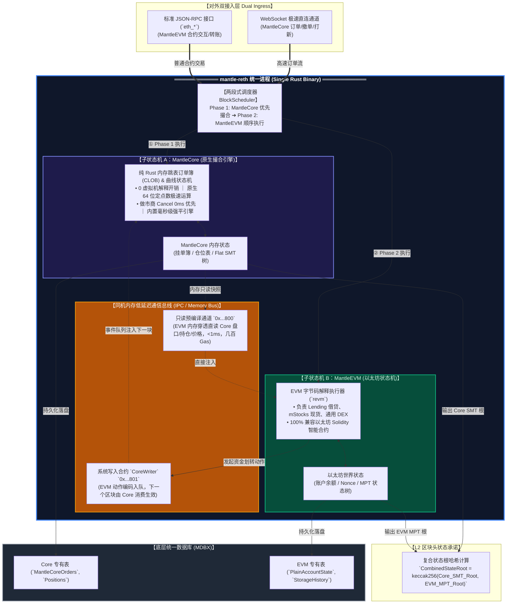
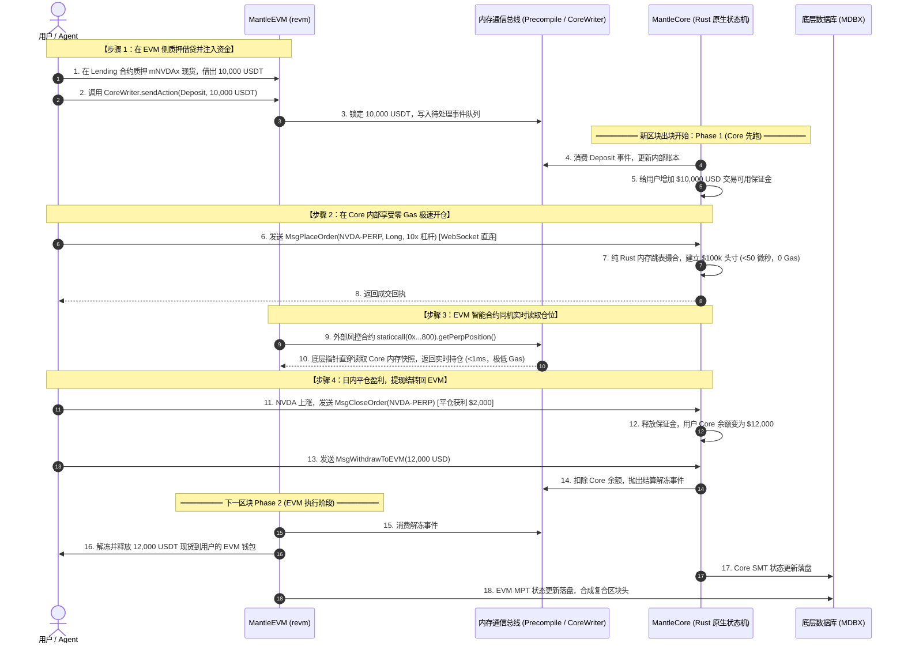

## 0. Background 信息

1. Mantle 链上资金充足，但是生态活跃度非常糟糕，目前的情况来说 TVL 是一个糟糕的数据指标，完全没有意义，Mantle 需要的是能带来 Revenue 的生态项目
2. 目前市场中已经证明自己的叙事有：meme，perps 和半个 prediction markets（受周期影响较大）
3. 趁着 mStocks 这个新资产的上线，Mantle 可以重新梳理自己的生态并针对上述的几个生态叙事进行全力支持
4. 在之前的分析中，我们得出目前 Mantle 的架构并不能完全适配三种产品，因此我们需要从架构上进行优化

## 1. 三种方案的综述

| **评估维度** | **路线一：Mantle L2 原生优化** | **路线二：Hyperliquid 同机双引擎** | **路线三：App-Specific 专有 L3** |
| :-- | :-- | :-- | :-- |
| **系统架构模式** | 单层单链（单 EVM） | 单层双状态机（EVM + Native） | **分层解耦（L2 总行 + 双专有 L3）** |
| **性能极限** | 200ms–500ms（受制于 L2 全网） | 10ms 内存撮合（单机极致） | **50ms–100ms（专享独占区块空间）** |
| **抗三明治夹子 (Anti-MEV)** | 弱（公共池竞价，难做纯 FIFO） | 强（内存顺序执行） | **极强（Sequencer 强制时间戳 FIFO）** |
| **状态爆炸** | ❌ 无法剪枝（受限于 EVM MPT 规范） | ⚠️ 局部支持（需自行维护双树） | **★ 原生物理剪枝（48h 自动归档删除）** |
| **资金流动性割裂度** | **★ 零割裂（同状态树）** | **★ 极低（内存系统调用切换）** | **低（远程保证金 + 意图闪电垫付抹平）** |
| **跨链桥攻击风险** | **★ 零风险（无跨链桥）** | **★ 零风险（无跨链桥）** | **高** |
| **主网爆破隔离性** | 差（高频交易拥堵会波及全网） | 极差（撮合引擎 Bug 会拖垮整链） | **★ 完美物理隔离（L3 风险绝不外溢）** |
| **以太坊对齐维护成本** | **★ 极低（紧跟官方主线即可）** | 极高（每次硬分叉都是补丁地狱） | **良好（L2 专心对齐，L3 独立敏捷升级）** |
| **Agent 机器一等公民支持** | 仅支持 ERC-4337 等外挂封装 | 需定制专用交互接口 | **★ 原生 2D Nonce 并发 + Session Keys** |

## 2. 每种方案优劣势详细分析

### 2.1 线路 1：Mantle L2 原生渐进演进路线

#### 2.1.1 Overviews

保留最传统、最稳健的公链演进思维：**不发新链，不破坏 EVM 兼容性，完全在 Mantle L2 主网上进行针对性优化。**

#### 2.1.2 该方案的优劣势分析

- 优点
  - 最大的优势就是继续保留可组合性的特点，所有的逻辑都运行在同一个状态机下，状态变更的验证保持一致性
    - 现在的趋势就是支持 Uniswap v4 + 一个 meme Launchpad 就会被用户认可
- 缺点
  - 性能瓶颈无法突破，目前没有纯通用 evm 的 onchain perps 出现
  - 无法做到状态隔离，应用定制化等对应用正向激励的功能，对于项目方来说没有吸引力
  - 受限于 Ethereum L1 的 EIPs 选择，新上的功能可能会有回退的可能（比如之前的 metaTX，目前遇到的 native AA 方向选择）

### 2.2 线路 2：Hyperliquid 模式的同机双引擎路线

受到 Hyperliquid 的启发，在同一个节点内挂载一个脱离 EVM 字节码、用 Rust 原生编写的高性能撮合引擎。这样的设计就需要我们将原本的使用的 reth 进行魔改，需要包含 revm 和高性能的 mantlecore 两部分。因此整个执行层就变成了需要包含一个高性能无 vm 设计的纯原生 rust 专有状态机（MantleCore）加上一个通用的 revm 虚拟机。

#### 2.2.1 Overviews

在 MantleCore 中不需要运行任何的解释器，直接跑原生的 cpu 机器码，负责一些应用特有逻辑（比如交易撮合，做市商撤单，仓位强平，meme 的 bonding curve 等），同时在状态管理方面，这个状态机中完全可以抛弃 evm 中繁重的 MPT，选择一些在内存中的快速数据结构（比如 SMT 之类的）。

这种方案的好处在于两个状态机是存活在同一个执行层中的，因此他们可以通过内存共享数据和状态，不需要额外的跨链操作，但本身两个状态机之间的状态又是独立的。

#### 2.2.2 详细的设计



当我们选择再内嵌一个 rust 状态机后，我们首先需要解决的就是复合状态机内部运转与同机低延迟通信协议的设计。

1. 为确保在单个区块内两套状态机的强一致性，mantle-reth 的出块流程严格拆解为两个时钟阶段，形成一个两段式区块执行流水线：
   1. Phase 1（MantleCore 优先撮合阶段）：
      1. Sequencer 优先执行全部原生交易：外部行情预言机更新 ➔ 做市商撤单（Cancel 0 延迟清空）➔ 用户吃单撮合 ➔ 仓位强平检查 ➔ Meme 曲线状态买卖；
      2. 产生最新的内存状态快照，计算出阶段性的 CoreStateRoot。
   2. Phase 2（MantleEVM 合约执行阶段）：
      1. 紧接着执行普通 evm 交易；
      2. 合约如需查询价格或保证金，通过预编译直接透传读取 Phase 1 留下的 Core 快照；
      3. 合约如需划转资产，调用 CoreWriter 写入动作队列；
      4. 产生 EVMStateRoot。
   3. Phase 3（区块头合成）：
      1. `CombinedBlockStateRoot = keccak256(CoreStateRoot, EVMStateRoot)`，生成唯一区块对外广播。
2. 第二个重点在于如何实现两个状态机之间的通信，我们想到的方式就是通过系统合约的方式来对一块共用的内存空间进行读写，需要注意的是我们不能用一般的 evm 合约来写，这应该是一个外部挂着 Solidity 接口但底层是一个 native precompile，用 rust 直接在 mantle-reth 中写的机器码函数，不会走 evm 解释器。

<Info>
  为什么不能是一个 evm 合约？

  - MantleCore 是原生 Rust 线程，它的订单簿、保证金数据是一堆原生的 Rust 结构体指针，而 evm 解释器包含的 opcode 只有堆栈操作（PUSH / POP）、内存读写（MLOAD / MSTORE）和存储读写（SLOAD / SSTORE），处于沙箱内的 EVM 字节码，物理上没有任何语法或指令去解引用一个操作系统的原生 Rust 内存地址
  - 如果我们硬要写成 evm 合约，唯一的做法就是不断讲 MantleCore 的数据用 SSTORE 搬运写入这个 EVM 合约的 Storage slot 里，但是这种做法完全不可用，因为 MPT 树的存在，导致 SSTORE 的 gas 消耗和性能无法跟上 MantleCore 的更新
</Info>

1. 当我们要实现“读”操作的时候，要做的就是封装一个 solidity 接口，然后在里面做跳转，让 CPU 直接跳出了 EVM 虚拟机，直接在宿主操作系统的 RAM 堆内存里，把 MantleCore 的原生数据读了出来并拷贝到了 EVM 的内存缓冲区
   1. 这是一个同步操作，即可以在单个区块中实现
   2. ```text
      // revm 执行引擎在处理 CALL / STATICCALL 时的核心分发逻辑
      impl EvmHandler for MantleHost {
         fn call(&mut self, target_address: Address, input: Bytes) -> CallResult {
             // 1. 检查目标地址是不是内置的预编译白名单
             if target_address == address!("0000000000000000000000000000000000000800") {
                 // ⭐️ 核心关键：直接拦截！不读磁盘！不加载 EVM 字节码！不启动 EVM 解释器！
                 // 直接调用用 Rust 编译成的 x86/ARM 原生机器指令：
                 return self.run_mantle_core_reader_precompile(input);
             }
             // 2. 如果不是预编译，才走常规逻辑：
             // 去 MPT 树查找账户 -> 加载 EVM 字节码 -> 开启虚拟机解释循环（eval_loop）
             self.execute_evm_bytecode(target_address, input)
         }
      }
      //---------------------- 实际的 Rust 逻辑 -------------------//
      fn run_mantle_core_reader_precompile(&self, input: Bytes) -> CallResult {
         // 步骤 A: 解析 ABI 编码的入参 (如: selector + trader 地址 + marketId)
         let (trader, market_id) = decode_input(&input);
         // 步骤 B: ⭐️ 核心魔法 —— 跨状态机指针穿透
         // 在出块流水线 Phase 1 结束时，MantleCore 会把它的当前状态打一个内存不可变快照:
         // self.core_snapshot: Arc<MantleCoreMemoryState>
         // 这里只需花费几十纳秒做一次 Rust 内存 HashMap 或数组索引查找：
         let position = self.core_snapshot.get_position(trader, market_id);
         // 步骤 C: 将 Rust 原生结构体数据打包成 EVM ABI 字节流
         let output = abi::encode(position.size, position.entry_price, position.pnl);
         // 步骤 D: 返回结果，只收取象征性的几百 Gas（只计算 CPU 内存读取成本）
         CallResult {
             gas_used: 300,
             return_data: output,
             revert: false,
         }
      }
      ```
   3. 当我们要实现“写”操作的时候，这里的设计复杂程度需要更多的考虑（因为涉及到用户的资金），两个状态机之间我们已经确定了是先 Core 然后 EVM 的执行顺序，这就意味着用户在 evm 上的 deposit 的操作最起码要等一个区块才会进入 Core，这是一个异步的过程，另外我们还需要方式 revert 的情况发生，所以我们可以依赖 event log 来管理下一个 mantlecore 中要处理的事件。

#### 2.2.3 交易流程的重新定义

我们在这里假定了一个场景来展示 MantleEVM 和 MantleCore 的协同工作情况：**用户在 EVM 质押 mStocks 借出 USDT，资金划转入 Core 极速开多 NVDA 股票合约，日内获利平仓并结算回 EVM。**



#### 2.2.4 该设计的优劣势分析

- 优点
  - 在引入高性能引擎的同时还保留了原本的 evm DeFi 可组合性（非原子的）
  - 也不会有 L3 存在的资金碎片化风险和跨链桥风险
- 缺点
  - 状态变更的有效性证明难产，由于之前我们是标准的 evm，因此我们可以快速集成 SP1 来实现 STF 的在 Ethereum 上的有效性证明，但是现在在 SP1 zkVM Guest 内部，证明程序必须同时跑通三个模块：
    1. Core 状态转换证明：验证纯 Rust 订单簿撮合与 Bonding Curve 算法正确性，state root 更新无误；
    2. EVM 状态转换证明：验证 revm 字节码执行与 MPT 树根更新无误；
    3. 跨引擎一致性约束：
       1. 约束 1：证明 Precompile 读出的数据确实等于 Core 内存快照；
       2. 约束 2：证明 CoreWriter 提交的动作在下一区块被 Core 无篡改执行。
  - 高额的维护成本，在当前的设计中我们需要维护 Mantle-Reth 这个执行层以及 MantleCore + REVM + Kona 的 hardfork，每一次 Ethereum Hardfork 都需要做适配
  - MantleCore 如果出现了 bug 会影响到 MantleEVM 以及整个 Mantle-reth 执行层，有宕机风险
  - 全节点运行门槛会提升（参考 Hyperliquid 的节点运行）
  - 可扩展性差，如果未来还需要支持别的业务场景，需要修改 MantleCore 来支持，业务逻辑很难隔离

<Info>
  为什么在 Hyperliquid 中状态变更有效性可以做的很简单

  - 因为 Hyperliquid 是一条 Alt L1，他的 finality 有自己的 HyperBFT 提供，他的共识是通过节点重放计算状态变更情况是否一致即可，而 Mantle 则需要向 Ethereum 提供基于 zk 的有效性证明（因为 Mantle 无法让 Ethereum L1 节点去重跑）
</Info>

### 2.3 线路 3：App-Specific 专有 L3 路线 

既然在 mantle-reth 执行层中塞入一个内嵌的高性能状态机是可行的，那么除了这种平行扩展的方式，我们自然也可以进行一个垂直扩展，这就引出了一种将 Mantle L2 作为结算层的 app-specific L3 的设计思路。 2.3.1 Overviews 整体的思路就是保留 Mantle L2 的目前沿用的升级节奏，将沉重的资产与 DeFi 留在 L2 确保绝对安全，将高频的交易与撮合拆分到专属 L3 追求极致性能，做到结算和执行的进一步解耦。而 Mantle L2 只需要提供基本的结算功能即可，用户把资金分配给一条 L3 后，可以连续在该 L3 内交易。订单撮合、保证金检查、仓位变更和清算不需要逐笔调用 L2。L3 异步向 L2 提交数据和证明，L2 验证后接受状态更新并允许相应提现。 

设计目的有三个：

1. 允许产品采用通用 EVM 合约较难高效表达的执行规则与数据结构。
2. 让不同应用拥有独立的资源预算和发布节奏，减少应用迭代对 Mantle L2 核心执行规则的影响。
3. 继续使用 Mantle 作为资产入口和结算空间，同时明确承担跨层异步通信、独立运维和流动性分配的成本。

<Info>
  适合 L3 的产品通常有以下特征：

  - 大量操作发生在应用内部
  - 用户能够预先分配资金
  - 核心业务不依赖逐笔跨层原子调用
  - 专用执行带来的收益足以覆盖一条链的固定成本 

  因此我们认为 meme Launchpad 和 onchain perps 非常适合这种架构设计
</Info>

#### 2.3.2 详细的设计

<Info>
  ```Solidity
  Mantle L2  |  Settlement space
  +------------------------------------------------------------------------+
  | Per-L3 Escrow | Inbox / Outbox | L3 State Registry                     |
  | Asset allocation | Message authentication | Verifier / version         |
  | Withdrawal limits | Forced requests | Upgrade / exit controls          |
  +------------------------------------------------------------------------+
                 |                                       ^
                 | Deposits / allocated credit           | Proofs / data
                 | Authenticated parent-chain messages   | Withdrawal claims
                 v                                       |
  +------------------------------------------------------------------------+
  | L2 <-> L3 protocol                                                     |
  | Parent references | Replay protection | Reorg recovery                 |
  | Data availability | Proof binding | Failure / exit handling            |
  +------------------------------------------------------------------------+
                 |                       |                       |
                 v                       v                       v
  Mantle L3s | App-specific execution
  +----------------------+ +----------------------+ +----------------------+
  | Launchpad L3         | | Perps L3             | | Private L3           |
  | Issuance / curve     | | Orders / positions   | | Permissioned trading |
  | Embedded AMM         | | Margin / liquidation | | Privacy / disclosure |
  | Own state + proving  | | Own state + proving  | | Own state + proving  |
  +----------------------+ +----------------------+ +----------------------+
  ```
</Info>

首先我们要解决的是如何在 Mantle L2 上提供结算能力以及如何完成 Mantle L3 的状态转移的 Finality，首先是 Mantle L2 上要新引入的结算相关的合约：

| 组件 | 职责 | 必须明确的边界 |
| :-- | :-- | :-- |
| `Per-L3 Escrow` | 托管实际资产，记录充值与兑付 | 一条 L3 不得凭自身证明提取另一条 L3 的资金 |
| `Inbox` | 接收充值和强制请求，分配稳定的消息标识与顺序 | 事件必须来自指定合约、链和已认可的父链历史 |
| `State Registry` | 保存每条 L3 最近接受的状态根、批次序号与程序版本 | 新证明只能从已接受前态连续推进 |
| `Verifier` | 验证业务状态转换证明及其公开输入 | 合约地址、验证密钥、程序和消息承诺必须绑定 |
| `Outbox / Withdrawal` | 认证批次父链操作，累加并兑付待领余额 | L3 先扣账；仅执行已验证批次，防止重复执行和重复兑付 |
| `Exit / Upgrade Controls` | 强制请求、异常冻结、退出和版本迁移 | 升级不能绕过资产归属，暂停不能成为无限冻结的唯一方案 |

而在 L3 上我们需要的组件包括：

<table>
  <colgroup>
    <col width="203" />
    <col width="550" />
  </colgroup>
  <thead>
    <tr>
      <td>**组件**</td>
      <td>**工作内容**</td>
    </tr>
  </thead>
  <tbody>
    <tr>
      <td>Sequencer / Executor</td>
      <td>接单、验签、排序、确定性执行、生成暂定回执</td>
    </tr>
    <tr>
      <td>Parent-chain Observer</td>
      <td>跟踪 L2 区块、日志、确认级别及重组</td>
    </tr>
    <tr>
      <td>State Store / Replay</td>
      <td>状态承诺、持久化、快照、崩溃恢复、确定性重放</td>
    </tr>
    <tr>
      <td>Batcher / DA Publisher</td>
      <td>编码并发布可恢复状态的数据</td>
    </tr>
    <tr>
      <td>Witness / Prover</td>
      <td>为执行准备见证，运行证明程序并提交证明</td>
    </tr>
    <tr>
      <td>API / Indexer / SDK</td>
      <td>订单、余额、仓位、充值、提现和确认状态</td>
    </tr>
    <tr>
      <td>Operations</td>
      <td>监控、备份、密钥管理、故障切换和告警</td>
    </tr>
  </tbody>
</table>

而同样我们需要关注的则是 L2 \<> L3 之间的通信协议，这里我们做一个简单的 high level 设计：

- L2 → L3 Deposit
  - 用户在 L2 Escrow 锁定资产，Inbox 记录目标 L3、资产、数量、接收账户和唯一消息标识。
  - L3 Observer 验证事件来源与父链区块，按确认策略纳入执行。
  - L3 消费 deposit 消息一次，增加相应账户权益，记录父链依赖和 Inbox 消费位置。
  - 数据发布与证明把该 deposit 绑定到规范父链输入，推进 L2 上的 L3 状态承诺。
- L3 内部的交易
  - Deposit 之后，交易、撤单、保证金占用、平仓及清算在 L3 本地执行。盈利必须对应其他账户、做市池或协议明确承担的负债变化，不能仅凭一笔 PnL 数值在 L2 增发可提现资产。批量结算可以减少 L2 调用，但实时保证金检查持续在 L3 内进行。结算节奏由证明吞吐、DA 成本、提现需求和允许的未结算敞口决定
- L3 -> L2 Withdraw
  - L3 按账户保证金规则检查可提金额，扣减可用余额，并产生唯一 Withdraw 操作。
  - 操作进入该批次的父链操作承诺，与同一状态转换的扣账绑定。
  - L2 验证批次后按顺序执行父链操作，检查操作数据与承诺一致，再增加对应用户的待领余额。
  - 用户或中继者调用领取接口，将资产支付至授权的资产所有者并减少待领余额；重复执行批次或超额领取均应失败。付款失败必须原子回退或保留可重试领取权。

#### 2.3.3 该设计的优劣势分析

- 优点
  - 可以保留之前的升级节奏，根据 Ethereum hardfork 以及 Mantle feature hardfork 的情况进行升级，但是不受限具体业务 L3 的而升级
  - 可以进行大量的实验性功能开发，不需要考虑 evm 兼容性
    - 解决 ux 的问题
      - 针对 Agentic Native AA 方案
    - 解决 L3s 之间的流动性孤岛问题
      - FCR + Based Rollups + 7683
  - 不需要考虑在 evm 上进行繁琐的工作，可以自定义执行环境
    - 高性能 evm 的工作比较困难，改为 app-specific execution 设计，根据需求做删减，像 Lighter 那样
      - General EVM 的性能瓶颈
        - Blocktime 不能进一步缩短，对于一些产品来说是不够的（比如 perps，Launchpad）
        - Lighter 的例子告诉我们即使是 zk Rollup，如果用的是阉割版的 evm 也可以做到很快很便宜
    - 与合约 dapps 相比
      - 不同的 appchain 可以定制化自己的排序规则，甚至可以审查用户的交易
      - 不同的 appchain 可以做到极致精简的状态机设置，抛弃通用的  EVM bytecodes 解释器，放弃 MPT 状态树
      - 不同的 appchain 可以采用不同账户模型，不同的 gas token
      - 不同的 appchain 之间有天然的拥堵隔离，起到 LFM 的作用不同 appchain
      - Appchain 的手续费可以进一步下降（因为我们可以选择 alt DA）
  - 提升 mantle 的地位，具备一定的结算能力
- 缺点
  - 实际跨链的存在导致风险提升
  - 流动性碎片化问题

## 3. 每种方案的开发成本评估 

需要评估每一个方向上的要做的开发工作以及开发工作量，首先是针对两个叙事和两个产品需要新增的 feature：

- 资产发行
  - 长尾资产/meme 的发行
    - 需要引入一个 meme Launchpad
      - Token Factory：创建资产、设置发行参数和权限。
      - Bonding Curve：买卖、储备管理、手续费与发行进度。
      - 基础毕业机制：达到阈值后建池，明确初始价格、滑点限制和 LP 归属。
    - 加分项
      - 解决 meme 火热导致其他业务 basefee 共同上涨
        - 需要评估独立计费与资源隔离，不能只靠 Launchpad 合约解决；共享 basefee 会受到整体区块使用量影响
      - 解决毕业后流动性迁移，减少被攻击的可能 减少迁移步骤和中间状态，降低抢跑、错误定价与重复迁移风险。 同层毕业与跨 L2／L3 毕业分别评估
  - 蓝筹资产/mStocks 的发行
- 资产交易
  - 针对现货交易
    - 优化真实用户的交易体验
      - 让用户有一个统一的交易入口，通过聚合器来帮助用户获取最佳报价
        - 接入已有 DEX、Launchpad 毕业池及做市商流动性。
        - 按扣除 Gas 和手续费后的实际到账数量比较报价。
        - 补齐交易模拟、滑点保护和成交回执。
      - 加分项
        - JIT Router
        - 通过套利实现返利
      - 引入 Prop AMM 来获取比 AMM DEX 更好的报价
    - 优化 bots 的交易体验
      - 引入一系列针对 bots/agents 的账户优化功能，我们将这些全部放到 native AA 的叙事中
        - Session keys
        - 2D nonce
        - Gas sponsor/gasless
        - MPC（防止私钥的单点故障问题）
      - 补充配套
        - 批量提交、批量撤单、请求去重和状态查询。
        - 交易权限与提币权限分离。
      - 实现上分两层
        - 先交付账户功能，再决定是否下沉到协议层。
  - 针对 perps 交易
    - 需要引入一个 Perps 产品。
      - 订单系统：下单、撤单、部分成交及撮合规则。
      - 风控系统：保证金、仓位、资金费、Oracle、清算和坏账处理。
      - 资金系统：充值、提现、手续费、返佣和结算。
      - 做市接入：订单簿与行情推送、低延迟 API、批量操作。
    - 需要重点验证的 infra 能力
      - 高峰期接单、撤单、成交回报和清算的延迟。
      - 明确的排序规则、交易权限与防垃圾请求机制。
      - 订单、余额和仓位的持久化、重放与故障恢复。
    - 首版之外另行评估
      - 多资产保证金、组合保证金和跨链统一保证金。

总结成一张表格：

| **功能域** | **Launchpad** | **Perps** |
| :-- | :-- | :-- |
| 资产与账户 | Token Factory、资产映射、曲线库存、手续费、发行上限 | 账户与子账户、抵押品、仓位、费用、资金费 |
| 交易 | 买卖、最小接收量、过期时间、确定性定价与舍入 | 下单、撤单、改单、部分成交、reduce-only、订单有效期 |
| 风控 | 储备守恒、毕业期间禁止重复兑付、异常资产规则 | 初始及维持保证金、预交易检查、订单保证金占用、清算和坏账规则 |
| 外部依赖 | 毕业后 DEX、LP 所有权、Token 标准及授权 | Oracle、mark/index price、数据过期与异常处理、清算执行者 |
| Agent 接入 | 受限买卖权限、额度、撤权、费用代付 | 交易与提款权限分离、批量撤单、独立 nonce、断连保护 |
| 数据与安全 | 索引、成交记录、储备对账、毕业状态 | 行情流、仓位流、全量对账、故障演练、恢复与退出 |

### 3.1 在方向 1 上构建 meme Launchpad 和 perps

#### 3.1.1 路线定位

保留 Mantle L2 的通用 EVM 执行及现有结算体系，优先通过应用合约、交易服务、Agent 账户和数据接口交付产品。只有在证明现有链级机制构成瓶颈后，才新增协议级改造。

通用 EVM 上可以构建 Perps。需要验证的具体问题是：在 Mantle 的目标负载、成本和确认语义下，能否承载目标级别的链上订单簿。

#### 3.1.2 Meme Launchpad 的开发工作

开发 Token Factory、发行模板、买卖曲线、手续费分配、储备管理与毕业控制器。买卖操作必须校验滑点、有效期和资产数量精度，覆盖极小交易、极大交易、舍入边界及重入风险。

毕业流程需要固定目标池、初始价格、迁移数量、LP 接收方及权限，并验证曲线库存与迁移资产守恒。处于毕业状态时，重复触发、交易与迁移并发、失败重试都应有确定的结果。

与现有 L2 DEX 的同层集成应作为基准。若未来改为 L3 发行、L2 毕业，应另行增加资产映射和跨层迁移状态机，不能沿用同层调用的安全假设。

#### 3.1.3 Perps 的开发工作

基准版本使用链下订单服务管理订单流，用户签名表达价格、方向、数量、市场、有效期及 nonce；链上验证成交授权、可用保证金、持仓变化和资金守恒。链下撮合方不能仅凭提交一个 PnL 数值增加可提现资产。

实现保证金、资金费、手续费、部分成交、订单撤销、清算和坏账处理。明确链下撤单回执与链上取消何时生效，防止已撤订单被结算，并设置服务中断后的降级路径。

需要明确以下三种替代实现的取舍：池式 Perps、RFQ Perps，以及链下 CLOB 加链上结算。它们对流动性、last-look、订单公平性与风险承担的要求不同，不能混为同一个模块。本次人月估算仅对应上述链下订单服务加链上验证结算版本。

对完全链上 CLOB 的探索单列为 PoC：测量最坏路径下的状态读写、订单取消、保证金占用和批量清算，不以平均 swap benchmark 推断可行性。

#### 3.1.4 Infra 与 Agent 支持

先交付签名交易授权、权限白名单、交易额度、授权到期、撤权、nonce lane、Gas sponsor 和提款权限隔离。应用内授权必须验证链 ID、合约或程序域、市场及操作类型，避免跨市场或跨版本重放。

补充行情和订单状态 WebSocket、快照与增量序号、缺口恢复、订单回执、SDK、监控与对账。对 Sequencer/RPC 的优化应先从准入、批处理、容量与服务质量入手。

交易准入或独立 RPC 不能保证热门 Meme 不推高同链 basefee。若要保证链级费用隔离，需要额外的资源预算或费市场设计，该能力不包含在基础版本中。

### 3.2 在方向 2 上完成高性能引擎实现

#### 3.2.1 路线定位

在 Mantle L2 的执行体系中引入 MantleCore，与 MantleEVM 共享链级确认和升级边界。开发对象是一个可验证的复合状态机，不只是嵌入 Rust 撮合服务。

初期建议以现有 zkVM 证明栈和统一的确定性 Core 规范为基准；自研专用证明系统不包含在以下估算内。联合 Guest 与分模块证明后聚合应在 PoC 中比较，而不是预先假定只能采用其中一种方式。

#### 3.2.2 MantleCore 状态机

实现确定性的账户、订单簿、保证金、资金费、曲线资产和手续费模块。热路径数据结构与密码学状态承诺应分别设计，不将 HashMap、订单索引和 SMT 视为同一种东西。

固定整数精度、舍入、溢出、事件顺序和序列化规则。禁止用机器本地时间、随机迭代顺序或未经承诺的外部输入决定共识结果。

实现 WAL、快照、崩溃恢复、状态迁移和独立重放。撤单、过期订单可以离开活跃索引，但账户余额、活跃仓位、待处理跨引擎动作和提现权益不能按固定时间直接删除。

#### 3.2.3 双引擎执行与资产通信

明确 Core、EVM、系统动作的执行次序和可见性。CoreReader 读取特定已承诺 Core 状态，不能在交易执行过程中读取随后台线程任意变化的数据。

CoreWriter 应形成可验证动作队列。成功 EVM 交易的事件可以作为动作来源，但必须纳入区块重放和证明规则，并校验发送者、来源合约、动作编码与唯一标识。回滚交易不能遗留可消费动作。

当期证明负责证明当期成功入队及已执行动作；后续证明负责证明从已承诺队列中按规则消费。动作成功、业务失败、重试和退款应分别定义，不承诺所有已入队操作必然成交。

Core 与 EVM 之间的资产划转需要完整的锁定、扣账、入账与待处理状态。单一链共识消除了额外链间共识边界，但不能消除资产记账和队列实现的漏洞。

#### 3.2.4 客户端、证明和兼容性

Reth 集成范围包括交易类型或系统输入、payload 构造、执行、状态持久化、RPC、同步、节点重放、崩溃恢复及升级迁移。

不能直接把 EVM 区块头的 stateRoot 改成两个根的哈希，并假定 Ethereum RPC 和账户证明自然兼容。需要保留 EVM 状态承诺语义，同时定义 Core 与动作队列的附加承诺，以及它们如何被 Mantle 的结算输出和证明绑定。

证明范围应包含 Core 规则、EVM 执行、跨引擎读写、资产守恒和父链输入。宿主机中的 Rust 函数能够高速执行，不代表该逻辑已经被 zkVM 证明；证明程序必须复现或验证对应的状态转换。

CoreReader 的 Gas、输入上限、返回大小和访存上限需要按最坏情况及证明成本定价。不能因为热缓存中的一次读取很快，就为任意查询设置象征性固定收费。

### 3.3 在方向 3 上完成 Mantle L2 改造和 L3 设计实现

#### 3.3.1 路线定位

保持 Mantle L2 的通用执行环境，将专用执行、产品参数和高频负载放到应用 L3。L2 提供资产托管和状态接受接口，L3 提供独立执行与证明。

#### 3.3.2 Mantle L2 侧工作

开发 Per-L3 Escrow、Inbox、State Registry、Verifier、Outbox/Withdrawal 和 Upgrade/Exit Controls。每条 L3 需要独立的资金归属、状态推进和版本权限，避免一条 L3 的有效证明被用于提取另一条 L3 的资产。

证明公开输入或等价承诺至少应绑定：

```Plain
parentChainId / l3Id / settlementContract
programVersion / verificationKey
previousStateRoot / newStateRoot / batchNumber
authenticatedParentReference / inboxProgress
withdrawalOrOutboxCommitment / dataCommitment
```

父链输入的真实性不能只由 Observer 判断；L2 合约与证明约束必须共同拒绝伪造充值、错误父链历史及重复消费。连续状态根、消费游标和批次序号需要一起验证。

提款先在 L3 扣账，再由已验证操作生成 L2 领取权。领取权只允许授权接收者使用；失败转账保留重试权益，重复领取和跨批次重放必须失败。

独立 Escrow 不足以保证经济隔离。需要避免共享坏账担保、未经限额的跨 L3 信贷和跨链统一保证金。共享管理员、verifier 和升级控制也需要明确故障影响范围。

#### 3.3.3 L3 运行时与数据协议

开发 Sequencer/Executor、Parent Observer、State Store、Batcher、DA Publisher、Witness/Prover、API/Indexer 和运行监控。

L3 的业务执行不能依赖逐单访问 L2。充值被接受后，订单保证金、成交、清算和资金费必须由 L3 本地状态确定；L2 侧资产仅作为已经分配的抵押或结算储备。

DA 方案至少需要回答：发布的是完整执行输入、状态差分还是两者组合；谁可以独立恢复账户状态；如何验证数据足以恢复；数据保留窗口与退出窗口如何衔接；数据不可得时怎样停止推进和退出。

初期只支持一种 DA 路径。采用 Alt DA 时，应将其可用性假设、成本、服务停止处理和可验证恢复机制明确加入设计，不能仅因费用较低而宣称安全性不变。

#### 3.3.4 失效处理与退出

分别设计 Sequencer 宕机、Prover 停摆、DA 不可用、父链重组、Oracle 失效和恶意升级时的处理路径。

证明积压超过约定阈值时，应限制新增风险并优先处理降风险操作；不能无限接单，只把风险留给未来证明。恢复服务需要从可验证快照与已发布数据开始，而不是只能信任运营方备份。

存在开放 Perps 仓位时，不能仅凭账户余额 Merkle proof 提取全部抵押品。退出方案需要定义冻结时间或状态、撤销未成交订单、平仓或最终结算价格、坏账分摊，以及不同账户和做市池之间的结算顺序。

“L3 证明已经被 Mantle L2 接受”与“该 L2 状态已经在 Ethereum 最终确认”是不同状态。API 与提现策略必须暴露这种区别。

#### 3.3.5 Launchpad L3 首期的资产生命周期

首先确定资产的 canonical 来源：是 L2 上的 ERC-20 在 L3 内镜像记账，还是 L3 原生发行后在 L2 映射。不能同时让两个环境独立增发而都被视为同一资产。

若采用 L3 发行、L2 DEX 毕业，需要固定跨层状态机：

```Plain
Curve Trading
-> Graduation Requested
-> L3 Trading Restricted / Migration State Frozen
-> Migration Batch Proven
-> L2 Assets Made Available
-> L2 Pool Initialized
-> User Claims / Mapping Activated
```

这里的“交易限制”需要按产品定义，不应无期限冻结用户。迁移超时、池初始化失败、重复执行、资产精度差异及用户未领取状态都要有恢复规则。该跨层迁移不具有同层交易的天然原子性。

Launchpad 的同层业务核心较简单，但资产映射与毕业可能成为首条 L3 的主要产品集成成本，应作为单独验收项。
